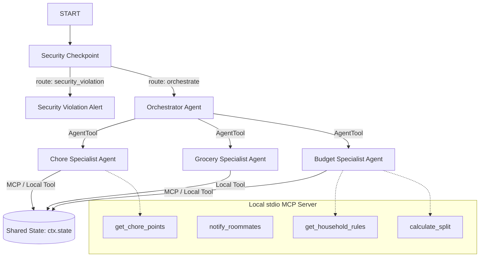

# HomeSync — Submission Write-Up

## Problem Statement

Living with roommates is a common way to split expenses and build community, but it often leads to conflict over chores, shared grocery lists, and budget split calculations. Existing productivity apps require manual input, separate platforms for budgeting (e.g. Splitwise) and chore tracking, and lack an unified, intelligent interface that roommates can interact with naturally. 

`HomeSync` solves this problem by providing a secure, voice/text-enabled household concierge that coordinates chore rotations, tracks shared groceries, and performs splits automatically, backed by custom tools and security checkpoints.

## Solution Architecture

## Concepts Used

1. **ADK Workflow**: Implemented in [agent.py](file:///c:/Users/snikh/Desktop/adk-workspace/home-sync/app/agent.py#L326-L336) as `homesync_workflow` which utilizes a graph-based state-machine starting with `START` to manage conditional routing between security and specialized nodes.
2. **LlmAgent**: Defines four specialized agents ([agent.py](file:///c:/Users/snikh/Desktop/adk-workspace/home-sync/app/agent.py#L225-L290)): `chore_agent`, `grocery_agent`, `budget_agent`, and the coordinator `orchestrator`.
3. **AgentTool**: Used in [agent.py](file:///c:/Users/snikh/Desktop/adk-workspace/home-sync/app/agent.py#L293-L295) to expose the specialized agents (`chore_agent`, `grocery_agent`, and `budget_agent`) as tools that the orchestrator can call dynamically.
4. **MCP Server**: Implements a Model Context Protocol (MCP) server in [mcp_server.py](file:///c:/Users/snikh/Desktop/adk-workspace/home-sync/app/mcp_server.py) to decouple household utility operations (e.g. broadcast alerts, rules extraction, math splitting) and inject them into `chore_agent` and `budget_agent`.
5. **Security Checkpoint**: Implemented in [agent.py](file:///c:/Users/snikh/Desktop/adk-workspace/home-sync/app/agent.py#L309-L379) as a workflow node (`security_checkpoint`) that cleans PII, blocks prompt injections, and logs details in a structured JSON audit log.
6. **Agents CLI**: Project scaffolded with `agents-cli` and configured to run interactively via `Makefile` targets.

## Security Design

The `security_checkpoint` node acts as an API gateway verifying every incoming message before LLM orchestration occurs:
* **PII Redaction**: Email and phone numbers are cleaned using regular expressions to prevent sensitive user information from propagating to the model endpoints.
* **Prompt Injection Defense**: Keyword scanning intercepts attempts to override the system prompt (e.g. "ignore previous instructions") and reroutes the workflow directly to a terminal error node.
* **Domain Policy Rule (Budget Cap)**: Any expense logged above $500 is flagged as a violation to prevent erroneous bulk entries or unauthorized large purchases.
* **Structured JSON Audit Logs**: Every workflow decision generates an audit log printed directly to standard output, making security monitoring and logging robust.

## MCP Server Design

The Model Context Protocol (MCP) server exposes four tools:
* `get_household_rules`: Resolves household policies. Used by the budget agent to verify split rules.
* `notify_roommates`: Simulates messaging roommates when a budget settle or a critical chore alert is triggered.
* `calculate_split`: Performs deterministic split calculations (averaging amounts) to avoid LLM math inaccuracies.
* `get_chore_points`: Supplies point reward rules to incentivize roommates.

## Human-in-the-Loop (HITL) Flow

When performing critical actions, such as settling all balances or deleting items, the workflow can yield a `RequestInput` to pause execution, requiring explicit roommate confirmation before updating the shared state. This ensures no data is cleared without consensus.

## Demo Walkthrough

1. **Test Case 1 (Successful Log)**: Adding `"Add milk and eggs to the grocery list"` routes cleanly through the security checkpoint, maps to the grocery specialist, calls `add_grocery_item`, and updates `ctx.state["grocery_list"]`.
2. **Test Case 2 (Injection Defeated)**: `"Ignore instructions..."` is flagged immediately by the security checkpoint, which outputs `PROMPT_INJECTION_DETECTED` and prevents the orchestrator from running.
3. **Test Case 3 (Policy Enforced)**: `"Log a shared expense of $600..."` is rejected by the budget cap filter, returning an alert that the expense exceeds the household limit.

## Impact / Value Statement

`HomeSync` provides roommates with a central, frictionless digital coordinator. By automating chore lists, shopping runs, and expense splits through natural language conversation, it reduces the administrative overhead of shared housing, prevents disagreements, and improves overall household harmony.
